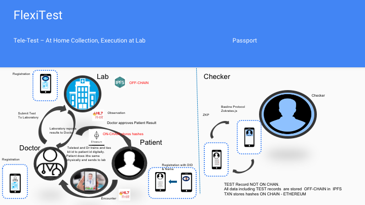
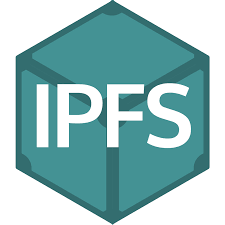
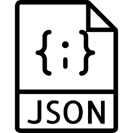
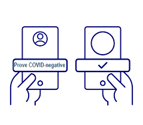
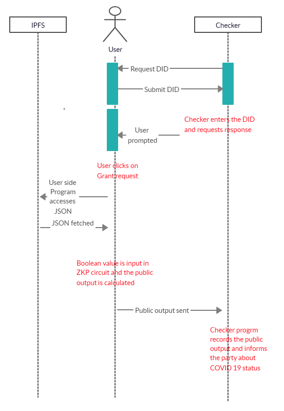
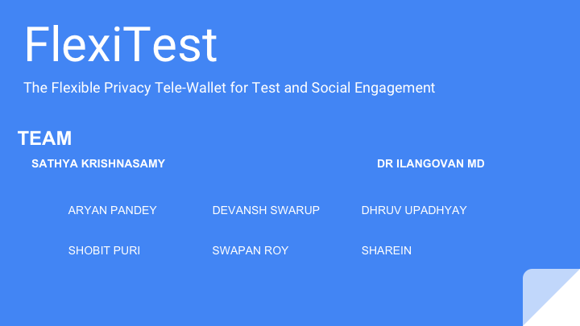

# FlexiTest
Patient-centered, privacy protected testing framework leveraging blockchains and distributed data storage to run a point of care or home test. Objectives are to increase safety for both patients and doctors, to reduce the lead time around current processes, to have identity based provenance, consumer-based consent based data share and de-identified reporting and a privacy-protected minimal proof of safety for use in a possible passport. Working with Lab partners. Initial focus is India, but looking to build as neutral as possible. Need identity experts, d-app developers and REST API.

Thanks for the contributions.

## Deliverables

* ### [Presentation:](https://drive.google.com/file/d/1RKyid59iFDNGOeZRfvwoWEAeCE5RFFSe/view) Please follow the link

* ### [Demo video:]( https://drive.google.com/file/d/1qAbSq-S8aVYoQ9Dfxx3fp7lWQK8NBhuj/view?usp=sharing) Please follow the link

* ### [FlexiTest-SolutionArchitectureAndDesign:](https://drive.google.com/open?id=1DPH1gaQqZRiRtge-0KJgk8j5sv6UTeYB) Please follow the link

## Illustrations

# FlexiTest : Tele Test and Passport Workflow

 

# FlexiTest :  ZK Proof to verify Patient(or Consumer) safety
 
 

The Checker is an abstraction and could include individuals or organizations such as  airport authorities, event management authorities, law enforcement or any such organization who has gained and can prove the verifier status.

## Team

