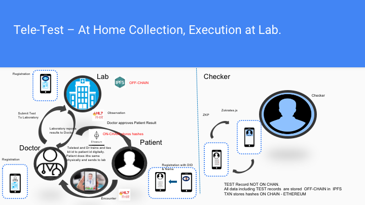

# FlexiTest
Patient-centered, privacy protected testing framework leveraging DLT/immutable ledgers to run a point of care or home test. Objective to reduce the lead time around current processes, increase safety for both patients and doctors ( including a identity based provenance )and consumer-based consent based data share. Have a design. Working with Lab partners. Initial focus is India, but looking to build as neutral as possible. Need identity experts, d-app developers and REST API. 
## Deliverables:
* ### [Presentation:](https://drive.google.com/file/d/1RKyid59iFDNGOeZRfvwoWEAeCE5RFFSe/view) Please follow the link

* ### [Demo video:]( https://drive.google.com/file/d/1qAbSq-S8aVYoQ9Dfxx3fp7lWQK8NBhuj/view?usp=sharing) Please follow the link

* ### [FlexiTest-SolutionArchitectureAndDesign:](https://drive.google.com/open?id=1DPH1gaQqZRiRtge-0KJgk8j5sv6UTeYB) Please follow the link

