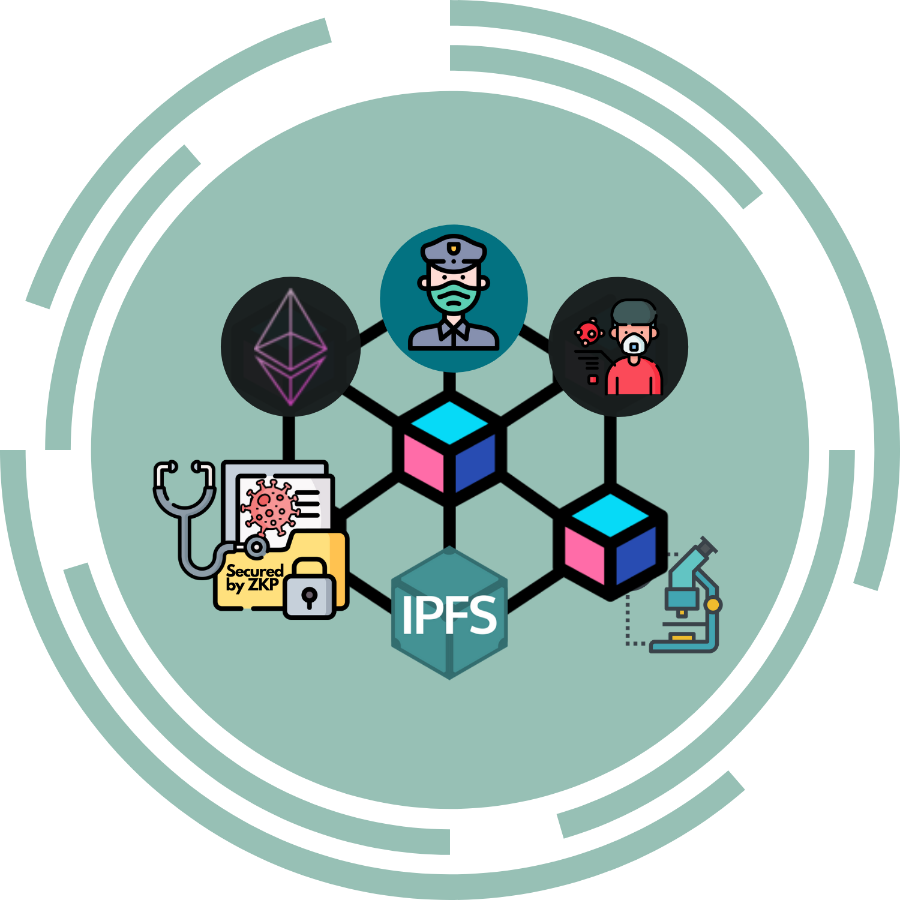
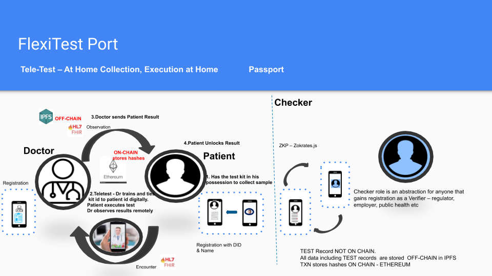
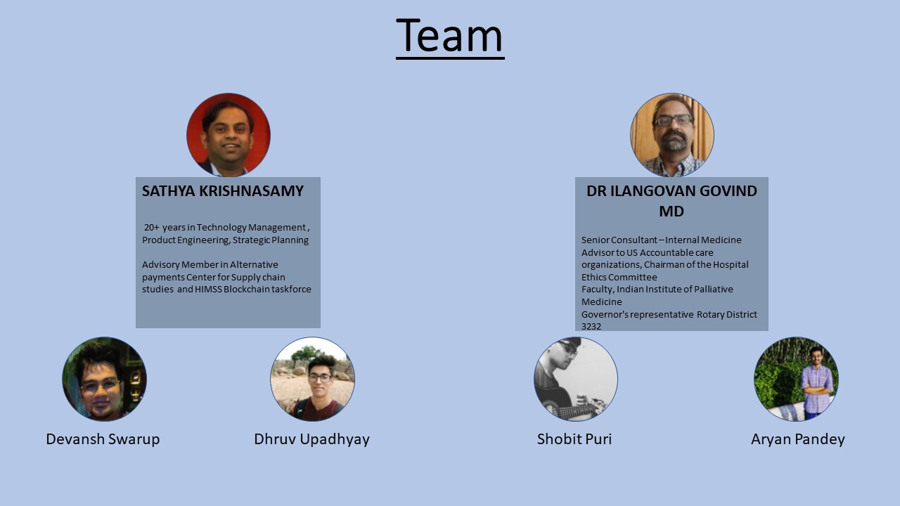

  
  <h1 align= "center">Flexi Test Port</h1>

Patient-centered, privacy protected testing framework leveraging blockchains and distributed data storage to run a point of care or home test. Objectives are to increase safety for both patients and doctors, to reduce the lead time around current processes, to have identity based provenance, consumer-based consent based data share and de-identified reporting and a privacy-protected minimal proof of safety for use in a possible passport. Working with Lab partners. Initial focus is India, but looking to build as neutral as possible. Need identity experts, d-app developers and REST API.

Thanks for the contributions.

## Deliverables

* ### [Presentation:](https://drive.google.com/file/d/1RKyid59iFDNGOeZRfvwoWEAeCE5RFFSe/view?usp=sharing) Please follow the link

* ### [Demo video:]( https://drive.google.com/file/d/1PL33c2vQO1Lw0Q-PGyML_rMJ-yL3vzsS/view?usp=sharing ) Please follow the link

* ### [FlexiTestPort-SolutionArchitectureAndDesign:](https://drive.google.com/file/d/1DPH1gaQqZRiRtge-0KJgk8j5sv6UTeYB/view?usp=sharing) Please follow the link

## Solution Highlights  

1. The Presentation Demonstration, the Video demonstration and GitHub illustrations vividly

explains the issues experienced in real-world issues we faced

     the enterprise systems and processes exposed limitations in availability, staffing and hence timely availability of
     results even after testing results were available.

     gaps in telehealth systems for full auditability / traceability and non-repudiation as more businesses are relying on
     these test results
  
     issues around accountability, transparency, speediness, and privacy protected reporting of de-identified , aggregated
     numbers for public health use
  
     and the realization that re-opening of the economy and wide- spread high scale SAFE testing are 2 sides of the same coin.

 the opportunities to solve these real world problems
    
     to  increase not just patient safety , but doctor / health worker safety

     to have a key tool for safe re-opening of the economy with privacy based minimalistic proof needed for overall safety yet      protecting civil liberties

2.The solution addresses the primary goal of the hackathon to solve the real world problems identified 

     by leveraging decentralization based technologies including IPFS, the ethereum blockchain to prove existence of key data      and metadata across organizations for an audit-ready yet privacy protected designs based on the ethereum stack 

     by using components already available in the blockchain ecosystem including DID specifications and components, 
     secure distributed file storage systems

3. The solution addresses the gaps in current systems

       by having key cross-organizational patient data/ meta-data secured for accountability, and cryptographically secured          data to quickly send information between parties in the teletext workflow reducing delays

       allowing whichever parties who are covered entities that have the consented data to report to public health without            delays
    
       de-identifying personal data and also reducing chances of re-identification 

4. The solution entails innovative elements to 

       incorporate standards like FHIR in to the solution for the business objects

        use Zero Knowledge proof designs based on the baseline protocol to those standard objects , and to design the                 arithmetic circuits to find if the user has been tested, and the status of their test results to the checker archetype         in a minimalistic proof.

Please refer to the details at 

https://github.com/ap-aryanpandey/Flexi-Test-Port/blob/master/README.md

https://github.com/ap-aryanpandey/Flexi-Test-Port/blob/master/zkp/README.md

## Illustrations

## Flexi Test Port : Tele Test and Passport Workflow

At Home Collection; At Lab Execution

At Home Collection; At Home Execution ( At Home Antibody Tests )

 

## Flexi Test Port :  ZK Proof to verify Patient(or Consumer) safety
 
 

The Checker is an abstraction and could include individuals or organizations such as  airport authorities, event management authorities, law enforcement or any such organization who has gained and can prove the verifier status.

# Team

  

* ### Sathya krishnasamy
   

 * ### Devansh Swarup 
        
 * ### Dhruv Upadhyay
        
 * ### Shobit Puri 
        
 * ### Aryan Pandey 
         
  
